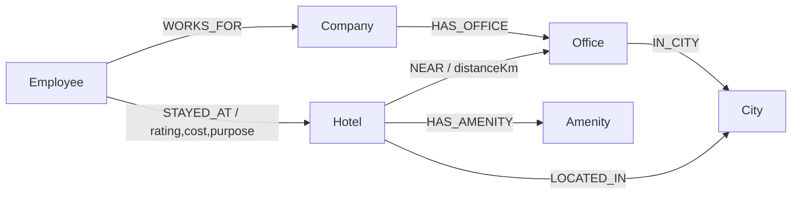

# StayGraph — Colleague-Based Corporate Hotel Recommender

An explainable corporate business-stay recommendation app backed by a **graph
database** ([CognoDB](https://console.cognodb.com), openCypher over Bolt).

Given a traveling employee and a destination city, StayGraph recommends hotels
based on **where their colleagues actually stayed and rated well** — and shows
the exact graph path behind every recommendation ("Recommended because 2
colleagues from your company rated it 4.5★ for FMCG field visits in Coimbatore").

The domain is modeled on [Hummingbird Digital](https://www.hummingbirdindia.com/)'s
business: automated corporate business-stay booking across tier 1–3 Indian
cities, for FMCG field forces, new-hire onboarding, long stays and MICE events.

> Seed data is **synthetic** and generated by a script — no real personal or
> customer data is used.

---

## Table of contents
- [Why a graph database?](#why-a-graph-database)
- [Data model](#data-model)
- [Architecture](#architecture)
- [Setup — CognoDB Cloud](#setup--cognodb-cloud)
- [Run locally](#run-locally)
- [The main queries explained](#the-main-queries-explained)
- [API reference](#api-reference)
- [Screenshots](#screenshots)
- [Deployment](#deployment)

---

## Why a graph database?

The valuable questions in corporate travel are about **connections**, not rows:

> *"Which hotels did my colleagues — people at my company — rate well in the
> city I'm traveling to, for the same kind of trip?"*

That is a multi-hop traversal:

```
(me:Employee) -[:WORKS_FOR]-> (company) <-[:WORKS_FOR]- (colleague)
              -[:STAYED_AT]-> (hotel) -[:LOCATED_IN]-> (city)
```

In a **relational** schema this becomes several self-joins across
`employees`, `companies`, `stays`, `hotels` and `cities`, plus a
`GROUP BY` to aggregate the colleague signal — and it gets worse the moment you
want the *reason* ("who exactly connects me to this hotel, and how?"), which is
a variable-length path best expressed with `shortestPath`.

In a **graph** database the query mirrors how a person describes the problem,
runs as index-free adjacency traversal, and the explanation path
(`Employee → Company ← Colleague → Hotel`) falls out of the same model for free.

Other questions in the app that are natural in a graph and awkward in SQL:
- **Similar-hotel fallback** — "if this hotel is full, find nearby hotels
  sharing the most amenities within the same budget band" (shared-attribute
  traversal).
- **Proximity** — "service apartments within 5 km of this company's office"
  (`Hotel -[:NEAR {distanceKm}]-> Office`).

---

## Data model

**Node labels**

| Label | Key properties |
|-------|----------------|
| `Company` | `companyId`, `name`, `industry` |
| `Employee` | `employeeId`, `name`, `role`, `homeCity` |
| `Office` | `officeId`, `name` |
| `City` | `name`, `tier`, `state` |
| `Hotel` | `hotelId`, `name`, `pricePerNight`, `starRating`, `safetyScore`, `gstRegistered` |
| `Amenity` | `name` |

**Relationship types**

| Relationship | From → To | Properties |
|--------------|-----------|------------|
| `WORKS_FOR` | `Employee` → `Company` | – |
| `HAS_OFFICE` | `Company` → `Office` | – |
| `IN_CITY` | `Office` → `City` | – |
| `LOCATED_IN` | `Hotel` → `City` | – |
| `NEAR` | `Hotel` → `Office` | `distanceKm` |
| `HAS_AMENITY` | `Hotel` → `Amenity` | – |
| `STAYED_AT` | `Employee` → `Hotel` | `rating`, `cost`, `purpose`, `nights` |



Uniqueness constraints (which also create indexes) are created by the seed
script on `Company.companyId`, `Employee.employeeId`, `Hotel.hotelId`,
`Office.officeId`, `City.name` and `Amenity.name`.

**Dataset size** (well within the CognoDB free `c0` tier): 6 companies,
~119 employees, 67 hotels across 14 cities, ~450 rated stays.

---

## Architecture

```
corporate-stay-recommender/
├── backend/                 # FastAPI + official neo4j driver
│   ├── app/
│   │   ├── config.py        # env-var settings (pydantic-settings)
│   │   ├── db.py            # driver lifecycle + graceful error handling
│   │   ├── queries.py       # all parameterised Cypher
│   │   ├── models.py        # Pydantic response models
│   │   └── main.py          # REST API endpoints
│   ├── requirements.txt
│   └── .env.example         # connection template (never commit real .env)
├── frontend/                # React + Vite + TypeScript
│   └── src/
│       ├── api.ts           # typed API client + error handling
│       ├── App.tsx          # control panel + results
│       └── components/      # cards, states, graph-path viz
├── scripts/
│   ├── data/dataset.json    # curated cities / companies / amenities
│   └── seed.py              # generates + loads the graph (idempotent)
└── README.md
```

- **Config & secrets:** the Bolt URI, user and password are read from
  environment variables only (`backend/.env`, ignored by git).
- **Graceful degradation:** if the database is unreachable, the API returns
  `503` and the UI shows a clear "CognoDB unreachable" state instead of
  crashing.
- **Parameterised queries only:** every Cypher statement passes user input as
  `$parameters`; there is no string-concatenated Cypher anywhere.

---

## Setup — CognoDB Cloud

1. Create a free account at <https://console.cognodb.com/signup> (no credit card).
2. Create a free **c0** instance and pick a region (provisions in ~1 minute).
3. Copy the connection details shown once:
   - URI like `bolt+s://<instance-id>.databases.cognodb.cloud`
   - username `cognodb` and the generated password (**save it immediately**).
4. Configure the backend:
   ```bash
   cp backend/.env.example backend/.env
   # edit backend/.env and fill in NEO4J_URI and NEO4J_PASSWORD
   ```

---

## Run locally

**Prerequisites:** Python 3.10+ and Node 18+.

### 1. Seed the graph
```bash
cd backend
python -m venv .venv && source .venv/bin/activate   # or use uv/conda
pip install -r requirements.txt
cd ..
python scripts/seed.py
```
You should see a summary like `Companies: 6 · Employees: 119 · Hotels: 67 · Stays: 451`.

### 2. Start the backend API
```bash
cd backend
uvicorn app.main:app --reload --port 8000
# API docs at http://localhost:8000/docs
```

### 3. Start the frontend
```bash
cd frontend
npm install
npm run dev
# open http://localhost:5173
```
The Vite dev server proxies `/api` to `http://localhost:8000`, so no extra
config is needed for local development.

---

## The main queries explained

All queries live in [`backend/app/queries.py`](backend/app/queries.py) and are
parameterised.

### 1. Colleague-based recommendation (the multi-hop traversal)
The core feature. Starting from the traveler, hop to their company, out to
colleagues, and into the hotels those colleagues rated ≥ 4★ in the destination
city — optionally filtered by trip purpose and price cap.

```cypher
MATCH (me:Employee {employeeId: $employeeId})-[:WORKS_FOR]->(company:Company)
MATCH (city:City {name: $city})
MATCH (company)<-[:WORKS_FOR]-(colleague:Employee)
      -[s:STAYED_AT]->(hotel:Hotel)-[:LOCATED_IN]->(city)
WHERE colleague <> me
  AND s.rating >= $minRating
  AND ($purpose  IS NULL OR s.purpose = $purpose)
  AND ($maxPrice IS NULL OR hotel.pricePerNight <= $maxPrice)
  AND NOT EXISTS { (me)-[:STAYED_AT]->(hotel) }
WITH hotel, city,
     count(DISTINCT colleague) AS colleagueCount,
     avg(s.rating)             AS avgRating,
     collect(DISTINCT colleague.name)[0..4] AS colleagues,
     collect(DISTINCT s.purpose)            AS purposes
RETURN hotel, colleagueCount, round(avgRating, 2) AS colleagueAvgRating,
       colleagues, purposes
ORDER BY colleagueCount DESC, colleagueAvgRating DESC, hotel.pricePerNight ASC
LIMIT $limit
```

### 2. Connection path (explainability — awkward for SQL)
The shortest path between the traveler and a hotel, rendered in the UI as the
"why". Variable-length pathfinding is a graph-native operation.

```cypher
MATCH (e:Employee {employeeId: $employeeId}), (h:Hotel {hotelId: $hotelId})
MATCH p = shortestPath((e)-[*..5]-(h))
RETURN [n IN nodes(p) | {label: head(labels(n)), name: coalesce(n.name, n.title)}] AS nodes,
       [r IN relationships(p) | type(r)] AS relationships,
       length(p) AS hops
```

### 3. Similar-hotel fallback (shared-attribute traversal)
When a hotel is full, find same-city hotels sharing the most amenities within a
±₹800 budget band.

```cypher
MATCH (base:Hotel {hotelId: $hotelId})-[:LOCATED_IN]->(city:City)
MATCH (base)-[:HAS_AMENITY]->(a:Amenity)<-[:HAS_AMENITY]-(other:Hotel)-[:LOCATED_IN]->(city)
WHERE other <> base AND abs(other.pricePerNight - base.pricePerNight) <= 800
WITH other, count(DISTINCT a) AS sharedAmenities
RETURN other, sharedAmenities
ORDER BY sharedAmenities DESC
LIMIT $limit
```

### 4. Near-office proximity ("within 5 km of workplace")
```cypher
MATCH (c:Company {name: $company})-[:HAS_OFFICE]->(o:Office)-[:IN_CITY]->(:City {name: $city})
MATCH (h:Hotel)-[n:NEAR]->(o)
WHERE n.distanceKm <= $maxKm
RETURN h, o.name AS office, n.distanceKm AS distanceKm
ORDER BY n.distanceKm ASC
```

---

## CognoDB compatibility notes

CognoDB speaks openCypher, but its dialect differs slightly from Neo4j 5. Two
adjustments were needed and are worth knowing:

- **No `round(value, precision)`** — CognoDB's `round()` takes a single
  argument. Two-decimal rounding is done as `round(x * 100.0) / 100.0`.
- **Exclude-by-list instead of `NOT (pattern)` / `NOT EXISTS { }`** — to skip
  hotels the traveler already used, we `collect()` their hotel ids into a list
  and filter with `NOT hotel.hotelId IN myHotels`, which is portable and
  predictable across engines.

## API reference

| Method | Path | Description |
|--------|------|-------------|
| `GET` | `/api/health` | DB connectivity status |
| `GET` | `/api/stats` | Node/relationship counts |
| `GET` | `/api/employees` | List travelers (with stay counts) |
| `GET` | `/api/employees/{id}` | Employee profile + recent stays |
| `GET` | `/api/cities` | Cities that have hotels |
| `GET` | `/api/employees/{id}/recommendations?city=&purpose=&max_price=` | **Colleague-based recommendations** |
| `GET` | `/api/employees/{id}/connection/{hotelId}` | Graph path explanation |
| `GET` | `/api/hotels/{id}/similar` | Similar-hotel fallback |
| `GET` | `/api/near-office?company=&city=&max_km=` | Hotels near an office |
| `GET` | `/api/hotels/search?q=` | Search hotels by name/city |

Interactive docs are available at `/docs` when the backend is running.

---

## Design system

The full UI/design-system reference — tokens, typography, glassmorphism,
components, motion, states, accessibility and responsiveness — is documented in
[`docs/UI-STYLE-GUIDE.md`](docs/UI-STYLE-GUIDE.md).

## Demo

- **Live app:** https://corporate-stay-recommender.vercel.app/
- **Screen recording:** [`docs/demo-screen-recording.mp4`](docs/demo-screen-recording.mp4)

## Screenshots

> Add screenshots of the running UI here before submitting:
> - `docs/screenshot-recommendations.png` — recommendations grid
> - `docs/screenshot-graph-path.png` — expanded "why this?" graph path

---

## Deployment

Config files for a zero-cost deploy are already in the repo: [`render.yaml`](render.yaml)
for the backend and [`frontend/vercel.json`](frontend/vercel.json) for the frontend.
Secrets are **never** stored in these files — they're entered in each platform's
dashboard as environment variables.

### 1. Backend on Render

1. Go to [render.com](https://render.com) → New → **Blueprint** → connect this
   GitHub repo. Render will detect `render.yaml` automatically.
   (Alternatively: New → **Web Service**, root directory `backend`, build
   command `pip install -r requirements.txt`, start command
   `uvicorn app.main:app --host 0.0.0.0 --port $PORT`.)
2. In the service's **Environment** tab, set:
   - `NEO4J_URI` — your CognoDB `bolt+s://...` URI
   - `NEO4J_USER` — `cognodb`
   - `NEO4J_PASSWORD` — your CognoDB password
   - `NEO4J_DATABASE` — `neo4j`
   - `ALLOWED_ORIGINS` — the frontend URL you'll get in step 2 (update after)
3. Deploy. Note the resulting URL, e.g. `https://corporate-stay-recommender-api.onrender.com`.
4. Sanity check: `curl https://<your-backend>.onrender.com/api/health`.

> Render's free tier spins the service down when idle — the first request
> after inactivity can take ~30–60s to wake up.

### 2. Frontend on Vercel

1. Go to [vercel.com](https://vercel.com) → New Project → import this repo.
2. Set **Root Directory** to `frontend`.
3. Add environment variable `VITE_API_BASE_URL` = the Render backend URL from
   step 1 (no trailing slash).
4. Deploy. Note the resulting URL, e.g. `https://corporate-stay-recommender.vercel.app`.

### 3. Close the loop (CORS)

Go back to the Render service → Environment → update `ALLOWED_ORIGINS` to the
Vercel URL from step 2, then trigger a redeploy so the backend accepts
requests from the live frontend.

### 4. Keep it running

Keep the CognoDB instance and the Render service active so reviewers can try
the app against live data during the evaluation window.
